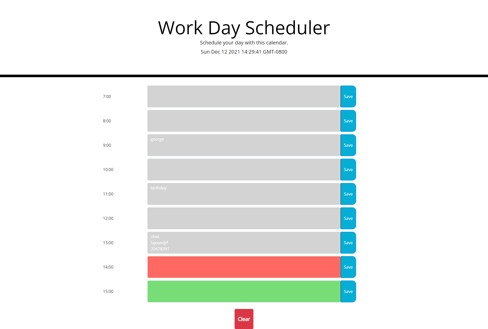

# Day to Day Scheduler

## Purpose
A simple application that shows a day to day scheduler. Past hours are shown in clear, current is red, and future is green.
Notes can be entered in boxes and saved to localStorage. The clear button will wipe the localStorage to start over.

## Built with
* HTML
* CSS
* JavaScript
* Bootstrap
* Moment.js

## Website
https://zaclark369.github.io/Day-To-Day-Planner/

## Screenshot
The websites landing page.
   

## Contribution
Made by Zachary Clark
* https://github.com/zaclark369

### ©️2021 
